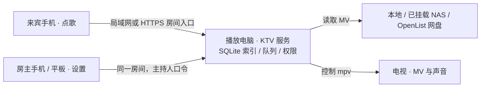

# 寰宇 KTV

把一台连接电视的电脑变成聚会 KTV：大家用手机扫码点歌，电脑从自己的 NAS、网盘或本地文件读取 MV，再由 mpv 播放到电视。房主可用手机或平板管理曲库和播放窗口，来宾使用单独的房间口令。

> 当前是需要自行运行的 alpha 版本，还没有可双击安装的 Mac/Windows 安装包，也不是托管云服务。开唱时，播放电脑、歌源和公网入口都需要保持可用。本项目不提供歌曲文件。

## 它怎样工作



手机传输搜索、点歌和控制请求。MV 从歌源流向播放电脑，再由播放器输出到电视；几 TB 的曲库无需复制到来宾手机。外网房间入口和播放电脑到家中 NAS 的连接是两条独立链路。

## 快速开始：先用一首本地 MV 跑通

需要 Git、Node.js **22 或更新版本**、npm 和 [mpv](https://mpv.io/installation/)。macOS 可用 `brew install mpv`；其他系统请把 mpv 加入 PATH，或在 `config.json` 的 `mpv.binary_path` 填写可执行文件路径。

```bash
git clone https://github.com/HuanchenCai/ktv.git
cd ktv
npm run setup
npm start
```

`setup` 安装依赖、下载 OpenList 并构建网页，需要网络。首次 `npm start` 会从 `config.example.json` 创建本机 `config.json`。随后在播放电脑浏览器打开 `http://127.0.0.1:8080/settings`，进入 **曲库与歌源 → 本地或已挂载 NAS**，填写含有 MV 的文件夹路径并点“扫描歌曲”。例如 macOS 的 `/Volumes/KTV`，或 Windows 的 `Z:/KTV`。打开点歌页点一首歌，确认 mpv 能播放。

只用本地文件、暂时不需要 OpenList 时，可跳过 OpenList 下载：

```bash
npm ci
npm --prefix web ci
npm --prefix web run build
npm start
```

这种模式下出现 OpenList 二进制未找到的提示是预期的；本地目录导入仍可使用。环境检查可运行 `npm run doctor`。如果 mpv 没有自动找到，在 `config.json` 设置 `mpv.binary_path` 后重启。

> 歌曲路径必须是**播放电脑**能访问的路径，不是点歌手机的路径。扫描只建立索引，不复制视频。NAS 断线或挂载路径改变后，需恢复连接并重新扫描。

## 配置歌源

| 歌源 | 目前的接入方法 | 播放方式 |
| --- | --- | --- |
| 本机目录、已挂载的 NAS 共享文件夹 | 在“曲库与歌源”填写播放电脑上的路径并扫描 | 从该路径读取 |
| 百度网盘等 OpenList 已挂载存储 | 在 OpenList 授权并挂载，配置扫描根目录后扫描 | 经 OpenList 获取链接；行为取决于驱动 |
| 百度网盘旧版直连 | 本机配置 BDUSS/STOKEN 后使用“百度盘扫描” | 按需下载后播放；属兼容路径 |
| YouTube / 抖音在线视频 | 安装并配置 yt-dlp，使用点歌页“线上” | 从视频源播放；可按配置关闭 |

**NAS：** MacBook 不在家时，可先用 Tailscale 连到家中 NAS，再用 Finder 连接 SMB 共享，确认 `/Volumes/KTV` 中的视频可打开。Windows 可用已挂载的盘符。绿联管理网页地址不等于歌曲文件夹地址；KTV 读取的是播放电脑实际挂载到的目录。具体步骤见[便携聚会与远程访问指南](docs/remote-party.md)。

**OpenList / 百度网盘：** `npm run setup` 已下载 OpenList。默认由 KTV 在本机启动，管理页通常为 `http://127.0.0.1:5244`。在 OpenList 中完成网盘授权和存储挂载，再把其 API token 写入被 Git 忽略的 `config.json`。例如：

第一次登录 OpenList 时，用户名通常为 `admin`；初始密码可从启动终端或 KTV“房间与设备”的提示读取。登录后修改密码，在 OpenList 的账户页面取得 API token。`openlist.root` 应指向已挂载的歌曲目录；如果挂载了多个歌源，可指向它们共同的上级目录。

```json
{
  "openlist": {
    "root": "/baidu/KTV",
    "api_token": "只保存在本机的令牌"
  }
}
```

上面只是需要修改的字段，**不要用片段覆盖整个配置文件**。如果 OpenList 运行在 NAS 等另一台机器上，设置 `openlist.base_url` 为该服务可达的地址，同时设 `openlist.auto_spawn` 为 `false`。歌源、登录和播放器参数保存在播放电脑的 `config.json`，不要提交口令、token 或 NAS 密码到 Git。

**更多网盘：** OpenList 提供其他存储驱动，但本项目尚未逐一完成阿里云盘、115、夸克等来源的端到端验证。它们属于后续适配与测试计划；README 不把“OpenList 有驱动”当作“KTV 已完整支持”。欢迎提交具体驱动的扫描、播放和断线恢复测试结果。

## 聚会时怎么操作

- **房主：** 用主持人口令在手机、平板或电脑打开同一个房间的“设置”。“曲库与歌源”管理路径、扫描和歌曲可见性；“房间与设备”选择播放窗口。隐藏歌曲不会删除文件，但不会出现在搜歌结果或新点歌队列。
- **来宾：** 用来宾口令加入，搜索歌曲并点歌；“下一首播放”会将歌曲排到当前歌曲之后。播放页提供暂停、切歌、重唱、音量和原伴唱等操作。来宾不能打开房主设置。
- **电视：** 只显示 mpv 播放窗口，不需要在电视上登录。房主可选择“独立窗口”并只投放该窗口，继续在笔记本上操作；或先把窗口移到扩展的电视屏幕，再切换“电视全屏”。镜像整个桌面时，笔记本设置也会出现在电视上。

没有配置公网房间时，应用默认面向可信局域网，不启用房间口令。不要把这个模式直接映射到互联网。

## 让手机流量也能加入

播放电脑需要一个指向 `http://127.0.0.1:8080` 的 **HTTPS 公网入口**，支持 WebSocket。可以使用自己的域名与隧道；快速试验可使用 Cloudflare 临时隧道。先让 KTV 停止运行，在另一个终端取得 `https://…trycloudflare.com` 地址，然后配置房间并启动。下面的 `example.trycloudflare.com` 必须替换为隧道实际显示的完整地址：

```bash
cloudflared tunnel --url http://127.0.0.1:8080
# 回到项目目录，在另一个终端执行：
npm run room:configure -- https://example.trycloudflare.com
npm start
```

`room:configure` 会生成**来宾口令**和不同的**主持人口令**，写入本机 `config.json`。把房间网址和来宾口令发给朋友；主持人口令只留给房主。临时隧道地址变化后，需重新配置并重启 KTV。手机关闭 Wi-Fi 后测试登录、搜歌、点歌和控制。家中 NAS 若在私有网络，播放电脑还须单独连通它；来宾手机不需要登录 Tailscale。完整步骤、Tailscale／NAS 挂载、常见 Bad Gateway 排查见[远程访问指南](docs/remote-party.md)。

`room.public_url` 只告诉 KTV 房间地址及允许的来源，**不会替你创建隧道或云服务器**。当前仍由播放电脑运行服务和 mpv；把静态网页单独部署到 GitHub Pages 不会让它完成播放。

## 常见问题

**几 TB 歌曲会下载到笔记本吗？** 本地／NAS 扫描只保存索引。OpenList 来源通常在点歌时取得播放链接；手动缓存或旧版百度直连会占用 `library_path` 的空间，需自行管理。真实播放速度取决于歌源、NAS 上行和当前网络。

**手机能直接播放 MV 到电视吗？** 当前架构中手机是点歌和控制终端，播放电脑运行 mpv 并负责电视输出。手机网页本身不是独立的电视播放器。

**可以下载双击安装吗？** 目前需要 Git、Node 和 mpv 从源码启动。安装包、自动更新和更多歌源验证仍在计划中。

**歌词和原伴唱怎么来？** MV 内已有的字幕可直接显示。原伴切换依赖视频的声道或音轨结构；不是每个来源都具备独立的伴奏声道。

## 开发与状态

```bash
npm test
npm run typecheck
npm --prefix web run build
```

当前重点是跨网络的真实聚会测试、播放窗口体验和歌源兼容性。下一步包括更多网盘驱动的端到端验证、安装包与部署简化；这些尚未标为已完成。项目目前未附带正式许可证文件，使用或再发布前请先联系仓库维护者。

English: Huanyu KTV is a self-hosted karaoke system. A playback computer reads your own NAS, cloud drive or local MV library and sends video to a TV through mpv. Guests request songs from their phones; hosts manage sources and playback with a separate room code. A remote party uses an HTTPS room entrance for control and a separate connection from the playback computer to its media source. See the [remote party guide](docs/remote-party.md).
